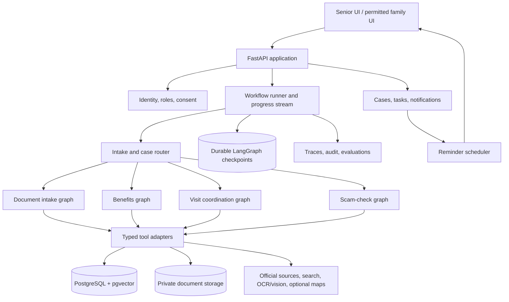

# SeniorLife OS — master project blueprint

**Project type:** BTech final-year major project  
**Planning assumption:** Start with an India-focused pilot in one state and one or two languages. Schemes, providers, rules, and contact details must be verified against current official sources before use.  
**Status:** Architecture proposal, not an implementation specification or implementation code.

## 1. Problem, vision, and boundaries

Older adults often have to connect information scattered across letters, websites, portals, family chats, prescriptions, and calendars to complete one real task. A pension application may need identity and income documents; a hospital visit may require records, transport, and a follow-up reminder. Existing assistants can explain one page but rarely maintain the *case*: what the person is trying to finish, what evidence is missing, who may help, which actions have been approved, and what should happen next.

**Vision:** SeniorLife OS is an accessible, consent-based case manager for independent living. It turns a plain-language request into a transparent plan; reads the user's approved records; researches current, attributable information; prepares the next action; pauses for review where needed; and tracks completion across sessions. The senior remains the decision-maker. A trusted family member or caregiver can assist only within explicit permissions.

**Project claim to demonstrate:** A bounded agentic workflow can complete multi-step administrative and coordination tasks more reliably than a one-turn chatbot by combining tools, persistent state, evidence checks, recovery paths, and human approval.

**Safety boundary:** It does not diagnose disease, change medication, certify eligibility, declare a message definitively safe, move money, call emergency services automatically, or silently submit applications/bookings. For a suspected emergency, display clear instructions to contact local emergency services or a trusted person; the application itself is not an emergency response system.

## 2. What to keep, modify, add, and defer

| Decision | Recommendation | Reason |
|---|---|---|
| Keep | Python, LangGraph, LangChain integrations, Pydantic, OpenAI models, web search, LangSmith | These match the practice code and already cover routing, structured outputs, tools, subgraphs, checkpoints, interrupts, and tracing. |
| Keep with a different role | Streamlit | Use it for early graph debugging and evaluator screens; use a React senior-facing UI for the integrated prototype if time permits. |
| Add | FastAPI, PostgreSQL, pgvector, private file storage | They provide application APIs, durable case records, grounded retrieval, and a document vault. pgvector inside PostgreSQL avoids a second database. |
| Modify | “Master orchestrator” | Make it a small intake/router plus case coordinator. Domain graphs own their steps; ordinary CRUD and scheduled reminders are backend services, not agents. |
| Modify | Benefits scope | Pilot a curated set of schemes for one jurisdiction. Eligibility is provisional until source rules and user facts are verified. Prepare a handoff package rather than automate fragile portal submission. |
| Modify | Healthcare scope | Focus on visit preparation and post-visit task capture. Provider discovery/booking can follow after reliable data and consent paths exist. |
| Modify | Family workspace | Start with explicit sharing of selected tasks and status. Do not give a family account blanket access to health or identity documents. |
| Defer | Travel booking, financial transactions, emergency dispatch, full portal automation, broad healthcare navigation, unrestricted web browsing | These multiply external dependencies, safety risk, and evaluation burden without strengthening the first demonstration. |
| Add | Source provenance, contradiction handling, idempotent actions, recovery states, measurable evaluation | These are the engineering elements that make the system credible as a major project. |

## 3. Product capability map

1. **Accessible intake and dashboard.** Plain language chat, large touch targets, adjustable text size, language choice, clear progress (“3 of 5 steps done”), and an explicit distinction between suggestions and completed actions. Voice can be an alternate input/output channel, not a separate source of truth.
2. **Profile and consent.** Basic details, location, language, accessibility needs, trusted contacts, and per-resource sharing grants. Sensitive facts are added or corrected only after the user confirms extracted values.
3. **Document vault.** Upload, classify, extract, review, find, and expire personal documents. Store the file separately from normalized fields and searchable chunks. A wrong extraction remains a draft until confirmed.
4. **Benefits case manager.** Research a selected government benefit; assess provisional eligibility with citations; match requirements against the vault; prepare a checklist or application bundle; track manual submission and follow-up.
5. **Healthcare visit coordinator.** Capture appointment details, assemble a user-approved visit packet, prepare questions, process an uploaded post-visit note into proposed tasks, and track follow-ups. Clinical interpretation stays outside scope.
6. **Scam check.** Analyze a pasted message, URL, or screenshot; highlight concrete warning signs and uncertainty; offer protective next steps and optional sharing with a trusted contact. Never label an unverified item “safe.”
7. **Tasks, reminders, and family coordination.** One task engine receives approved actions from any workflow. A scheduler sends notifications according to user choices and permissions. Family can accept assigned tasks and report completion.
8. **Mobility and day-to-day coordination.** Later: accessible route/provider comparison, transport checklist, service visits, and travel preparation, using the same case/task architecture.

## 4. System architecture

**Separation of responsibility:** FastAPI authenticates requests, checks permissions, owns transactions, and exposes case/task/document APIs. LangGraph handles decisions whose next step depends on evidence or user input. Typed tools query the application services; graphs do not construct arbitrary SQL or use unrestricted file access. PostgreSQL holds authoritative business records. LangGraph checkpoints hold temporary execution state. The application never treats a checkpoint or an LLM summary as the canonical user profile.

**Run identity:** A workflow run has its own `run_id`/LangGraph `thread_id`, linked to `case_id` and `user_id`. A case may have several runs over time. New user requests should not accidentally resume an old run. An interrupted run resumes using its exact thread ID after an authorized approval response.

## 5. Graph design principles

- Make a **separate graph** when a workflow has distinct state, branching, tools, retries, and approval points. Do not make each feature tile or each CRUD operation a graph.
- A **node** is a bounded operation such as classify input, retrieve evidence, validate fields, compare requirements, draft a plan, or persist an approved task. Only some nodes require an LLM.
- Use typed/Pydantic outputs for extracted facts, evidence references, requirements, action proposals, and error states. Keep raw evidence references alongside conclusions.
- Put external side effects in dedicated post-approval nodes. Make them idempotent using a stable action ID, so replay or retry cannot duplicate a task, message, or booking.
- A failed search, unreadable file, conflicting rule, or missing fact is an explicit state that routes to retry, alternate source, or user clarification; it is not silently filled by the model.
- Checkpoint at meaningful boundaries. Keep large files and full document text out of graph state; store IDs, snippets, and retrieval references instead.

### Graph inventory

| Graph / subgraph | Role | Prototype? |
|---|---|---|
| Intake/router | Classify intent, attach or create a case, identify missing information, select a domain graph, explain the next step | Yes |
| Document intake | Classify upload, extract, validate, user-review, index, and publish confirmed fields | Yes |
| Evidence retrieval subgraph | Select authorized sources, retrieve, rank, check freshness/contradictions, return citations and uncertainty | Yes; reused by benefits and scam check |
| Document match subgraph | Compare a case's required document types and validity rules with authorized vault metadata | Yes; reused by benefits and visit prep |
| Benefits case | Eligibility screening, requirement matching, package preparation, handoff, and status follow-up | Yes |
| Healthcare visit | Pre-visit packet and post-visit proposed tasks | Yes, in a narrow form |
| Scam check | Multimodal extraction, signals, verification, advice, optional family escalation | Yes if schedule allows after the core two cases |
| Action review subgraph | Show proposed changes/external actions, wait for approve/edit/reject, then execute idempotently | Yes; shared |
| Mobility/travel | Accessible options, comparison, checklist, booking handoff | Extension |

## 6. End-to-end workflows and node responsibilities

### A. Shared intake and case continuation

**Flow:** Message or voice transcript → intent and urgency classification → resolve an existing case or propose a new one → load the minimum permitted profile/case context → route to one domain graph → return a step-by-step status card.

**Nodes:**

1. **Normalize input:** detect language, preserve original wording, attach uploaded document IDs, and identify whether an urgent safety banner is needed.
2. **Intent/case resolver:** distinguish a new request from an update (“I got the certificate”) or a question about a current case. Ask when two cases could match.
3. **Context loader:** fetch only permitted profile facts, case status, and relevant task/document metadata.
4. **Router:** choose benefits, visit, scam, document intake, or ordinary task operation. Return an understandable fallback for out-of-scope requests.

**Agentic element:** It uses persistent state to change the next step, rather than restarting a generic chat every time.

### B. Document intake and records

**Flow:** Upload → malware/file-type/size validation → classify → OCR or multimodal extraction → structured field proposal → consistency and confidence checks → human correction/confirmation → encrypted/private storage metadata → index searchable text → notify the originating case that a missing document may now be available.

**Nodes:** classifier, OCR/vision extractor, field validator, duplicate/version detector, review interrupt, vault publisher. Deterministic validators handle dates, required fields, and expiry logic. The model assists classification/extraction but does not assert legal validity.

**Output:** Document type, owner, issue/expiry dates if known, extracted fields with page/region provenance, confirmation status, and searchable chunks. Store masked identifiers in general views. A missing or low-quality scan routes to re-upload; conflicting names route to review. Original files never enter a public vector collection.

### C. Benefits and administrative application case

**Flow:** Select a benefit or describe the need → collect only necessary profile facts → retrieve current official scheme material → extract eligibility and required documents with source/date → compare user facts with criteria → label each criterion **met / unmet / unknown / source conflict** → match available documents → ask for missing facts/files → draft an application checklist and prefilled *reviewable* fields → review → export a handoff bundle or guided official-portal link → record user-reported submission/reference number → reminders and status tracking.

**Nodes:** need/scheme resolver; official-source researcher; rule extractor; eligibility evaluator; document matcher (subgraph); missing-information planner; package drafter; evidence/consistency reviewer; approval interrupt; case updater.

**Tools:** curated scheme catalogue, official-page fetch/search, source snapshot cache, profile read, vault metadata search, PDF/text extraction, task service, export builder. Web search is a discovery tool; official page content or a curated authoritative source is the evidence for a rule. Show a source URL, retrieval date, jurisdiction, and uncertainty with each material claim. If a rule changed or sources conflict, stop at “needs confirmation.”

**Prototype deliverable:** An eligibility worksheet, document gap list, and application checklist/package for two or three representative schemes in one jurisdiction. Actual submission remains manual unless an official supported API exists.

### D. Healthcare visit coordination

**Pre-visit flow:** Capture appointment details (or draft them) → ask what information the user wants to share → retrieve approved relevant records → prepare a concise visit summary and question list → propose travel/preparation tasks → review → save packet and reminders.

**Post-visit flow:** Upload prescription/discharge note or type instructions → extract literal appointment/test/follow-up instructions with page citations → flag ambiguity or handwriting uncertainty → user or clinician confirms interpretations → create due-date tasks and reminders → track completion.

**Nodes:** appointment intake, consent/context selection, record retriever, visit-packet drafter, note extractor, instruction classifier, ambiguity gate, task-proposal planner, approval interrupt, task writer. If text suggests an urgent issue, route to a warning and seek human help; do not generate clinical recommendations. Medication directions can be displayed as extracted text with provenance, but dose changes and clinical reminders require explicit verification and are outside the first prototype.

**Tools:** vault retrieval, calendar/task service, optional maps/provider directory later, OCR/vision. The first prototype can use user-entered appointment details, avoiding unreliable provider inventory and booking APIs.

### E. Scam and suspicious-message check

**Flow:** Paste a message/link or upload screenshot → OCR/vision extraction → detect requests for OTP/password/payment, urgency, impersonation, and link patterns → optionally compare claimed organization/channel with an official source → produce **risk indicators and confidence**, not a guarantee → suggest safe next actions → ask before sharing with a trusted contact.

**Nodes:** content extractor, indicator detector (rules + model), URL/domain parser, claim/source verifier, risk explanation writer, safety reviewer, optional share approval and notifier. Never open the suspicious link in an authenticated browser or submit data to it. A screenshot with unreadable text routes to “cannot assess.”

**Prototype deliverable:** Explainable analysis for SMS/WhatsApp-style screenshots and pasted text, with a small labeled test set. Domain age/reputation feeds are optional; their absence must not be replaced by invented certainty.

### F. Shared tasks, reminders, and family assistance

**Flow:** A domain graph proposes task(s) → user reviews title, owner, due date, visibility, and notification method → task service saves them → scheduler sends reminders → senior/family marks completion → case coordinator updates next steps. When a family member is assigned, the senior authorizes exactly what description and document access that person receives.

**Components:** proposal/approval can be a graph subgraph; saving, scheduling, and completion are ordinary backend operations. A periodic scheduler is more reliable than an LLM “reminder agent.” A family request for more access becomes a consent workflow, never an implicit permission from kinship.

### G. Mobility and day-to-day extension

**Flow:** Capture destination/task and mobility constraints → retrieve current route/provider options → compare accessibility claims and transfer burden → surface unknowns → prepare checklist and assistance requests → approval → manual booking or supported API action → reminders. The same case, task, document, and approval services apply. Because accessible facility data may be incomplete, every recommendation must distinguish verified facts from unverified listings.

## 7. Shared state, memory, and retrieval

**Three persistence layers have different jobs:**

1. **PostgreSQL business records:** authoritative users, profiles, grants, cases, documents, extracted fields, tasks, approvals, notifications, source metadata, and audit events.
2. **LangGraph checkpointer:** per-run execution state needed for pause/resume, retries, and inspection. Use a durable PostgreSQL-backed checkpointer for the integrated prototype. In-memory checkpointing is fine only for local exercises.
3. **Retrieval index:** pgvector embeddings for curated scheme text and user-approved document chunks. Every chunk carries `owner_id`/access scope, document/source ID, page, version, timestamp, and sensitivity tag. Permission filtering must happen before retrieval results are sent to the model.

**Memory policy:** Explicit profile preferences (language, font size, mobility needs), user-confirmed facts, and case outcomes may persist across runs. Conversations are not automatically converted into “facts.” The assistant can propose a memory update and ask the user to confirm it. Time-sensitive facts have an `as_of` or expiry. A health or financial fact is loaded only for an authorized purpose. A concise case summary helps routing, but the linked records remain the source of truth.

**RAG roles:** Use retrieval for long, changing text such as scheme rules and the user's uploaded documents. Use structured database queries for exact dates, eligibility fields, tasks, and permission checks. Use live web research only when current information is needed; prefer official sources and capture the exact cited page. OCR/vision turns image/PDF inputs into candidates for review; it does not bypass consent or validation. Voice is a UI adapter: speech-to-text enters the same workflow, text-to-speech reads the same approved response.

## 8. Data model and lifecycle

| Entity | Essential fields / relationships |
|---|---|
| Account, senior profile | Account ID, role; profile owner, language, locale, accessibility preferences, confirmed demographic facts |
| Trusted contact and grant | Inviter, recipient, resource scope, permitted action, expiry/revocation, consent timestamp |
| Case | Owner, type, goal, status, current step, source request, assigned helper, created/updated dates |
| Workflow run / checkpoint reference | Run ID, case ID, graph type/version, thread ID, status, interruption reason, retry/error summary |
| Document and version | Owner, type, storage key, checksum, upload date, issue/expiry dates, processing/confirmation status, sensitivity |
| Extracted fact | Document/version, field, value, confidence, page/region, reviewer, confirmed value |
| Source record / knowledge chunk | URL or document ID, publisher, jurisdiction, retrieval date, effective date if known, chunk text/vector, version |
| Eligibility assessment | Case, criterion, met/unmet/unknown/conflict, supporting fact IDs, source IDs, assessed date |
| Action proposal and approval | Proposed payload, actor, approver, edit/reject decision, timestamp, idempotency key, execution result |
| Task and reminder | Case, owner/assignee, due date, status, visibility, reminder schedule, origin proposal |
| Notification and audit event | Recipient/channel/delivery state; actor, action, resource, timestamp, result |

**State progression:** `created → gathering_information → evaluating → needs_user_input/review → ready_for_handoff → submitted_by_user → follow_up → completed`, with `paused`, `cancelled`, and `failed` paths. These are case states; individual workflow runs may finish while the case stays open. Reopening a case creates a new run linked to the same case.

**Data handling:** Encrypt files at rest where hosted, use signed short-lived downloads, keep secrets out of graph state/traces, redact sensitive text in logs, require permission checks on each retrieval/tool call, and provide export/delete paths. Minimize real personal data during development: synthetic documents and consented test data are sufficient for evaluation.

## 9. Human review and action policy

| Situation | System behavior |
|---|---|
| Confirm profile fact or OCR extraction | Show the proposed value, source page, and editable correction before it becomes authoritative. |
| Eligibility result | Show criterion-level evidence and unknowns; user may accept a provisional checklist, not a guaranteed decision. |
| Create reminders/tasks | Show title, due date, assignee, and sharing scope. For low-risk private tasks, a user setting may allow streamlined confirmation. |
| Share document/health information | Require explicit per-recipient approval and a visible summary of what will be shared. |
| Contact family, book, submit, or export a sensitive bundle | Interrupt before the external action; record approve/edit/reject. Recheck permissions at execution time. |
| Scam warning | Give immediate protective guidance; ask before notifying another person. |

The review UI must display the exact action payload, not just “Approve?” After resume, the execution node uses an idempotency key and records the outcome. LangGraph's documented interrupt/checkpoint model supports this pause-and-resume design; code before an interrupt can run again on resume, so side effects belong after the approval boundary. [LangGraph interrupts](https://docs.langchain.com/oss/python/langgraph/interrupts).

## 10. Tools and external services

| Need | Prototype choice | Later option / constraint |
|---|---|---|
| LLM and structured extraction | Existing OpenAI integration with Pydantic schemas | Benchmark smaller/cheaper models per node. |
| Search and source collection | Existing search integration plus allowlisted official pages | Additional licensed feeds; preserve source/version records. |
| Documents | PDF text extraction, OCR/vision for scans, private local or S3-compatible storage | Better handwriting models and document review UI. |
| Retrieval | PostgreSQL + pgvector; metadata filters and keyword fallback | Separate vector service only if scale justifies it. |
| Notifications | In-app and email in prototype | SMS/WhatsApp only through approved provider and consent. |
| Maps/providers | None required for core prototype | Maps/places APIs for visit and mobility workflows, with accessibility-data caveats. |
| Authentication | FastAPI auth with session/JWT approach and role/consent checks | External identity provider if deployment requires it. |
| Observability | LangSmith traces with redaction, structured app logs, audit table | Cost/latency dashboards and automated regression evaluation. |

Define each tool with narrow parameters, timeouts, retry rules, and a typed result including `success`, `source`, `retrieved_at`, and an error code. Search results and uploaded documents are untrusted content, never instructions to the agent. Tool access is bound to the authenticated user and case, not to whatever identity a prompt claims.

## 11. Frontend/backend contract

**Senior screens:** home/“what needs attention,” guided conversation, case timeline, document vault with review, benefit worksheet, visit packet, scam check, and approval panel. The interface should use large controls, high contrast, plain labels, language selection, and text alternatives to voice. Always show “suggested,” “awaiting approval,” or “completed” accurately.

**Family screens:** only permitted case/task summaries, assigned-task action, access-request flow, and audit of what was shared. An admin screen can manage the curated source catalogue and inspect de-identified evaluation traces, without unrestricted document access.

**API shape:** auth/profile/consent endpoints; document upload and review endpoints; case and task CRUD; start or continue workflow; stream progress/events; list pending approvals; approve/edit/reject; retrieve cited evidence and generated handoff packages. The frontend never calls model, search, or storage credentials directly. FastAPI checks identity and consent before starting/resuming a graph. Stream user-friendly node milestones instead of raw chain-of-thought or private prompts.

**Execution:** The request handler starts a run and returns its ID; long OCR/search tasks run in a worker or bounded background process. Progress events update the case timeline. Interrupted runs remain pending until approval. A small scheduler reads persisted reminders. Keep deployment as one backend, one frontend, one PostgreSQL, and private file storage initially; add a queue only when real concurrency requires it.

## 12. First working prototype and phased build

**Vertical slice 1 — documents + benefits:** Login as a senior; enter a confirmed profile; upload a sample identity/income document; review extracted fields; open a benefit case; retrieve official evidence for a curated scheme; see provisional eligibility and missing documents; approve a checklist/task; resume after uploading the missing file; export a reviewed handoff package. This slice demonstrates the shared state and graph architecture.

**Vertical slice 2 — healthcare coordination:** Enter an appointment; select which records to include; generate and approve a visit packet; upload a sample post-visit note; review extracted follow-up instructions; create and complete reminders. Reuse the vault, approval, and task services.

**Vertical slice 3 — safety and collaboration:** Add screenshot scam checking and consent-based family task sharing. Add voice input/output only after the text flows work; otherwise it hides workflow flaws behind a more complex UI.

**Extensions:** More states/schemes, provider and accessible travel comparison, official integrations where available, multilingual voice, caregiver workflows, calendar sync, and stronger accessibility user testing. Each extension should reuse the same cases, consent, document, and task contracts.

**Suggested sequence:** (1) data model and auth/consent; (2) document ingestion/review; (3) graph runner with durable checkpoints and approval UI; (4) benefits graph with curated sources; (5) task/reminder service; (6) healthcare graph; (7) scam graph; (8) frontend refinement and evaluation. Build a complete vertical slice before adding another graph.

## 13. Demonstrating meaningful agentic behavior

A convincing demo should show a case changing over time. Example: “Help me apply for the pension.” The router starts a case. The benefits graph looks up current criteria, finds a confirmed age document but no income proof, and creates a missing-document request. The user uploads a certificate; the document graph extracts a date and income amount, flags an unreadable line, and waits for correction. The benefits graph resumes, updates the criterion assessment, prepares a package, and pauses for final approval. After the user records a submission number, the task service schedules a follow-up. Every step is traceable to a tool result, user-confirmed fact, or source page.

The same senior later asks, “What is still pending?” The assistant queries real case/task records and reports the pension follow-up alongside the visit reminder. This cross-workflow continuity is the strongest evidence that the application is more than several disconnected chatbots.

**Where reasoning belongs:** choosing next tools, resolving uncertain intent, extracting candidate fields, comparing complex textual rules with structured facts, detecting contradictions, and planning next steps. **Where deterministic code belongs:** authentication, authorization, date arithmetic, state transitions, validation, storage, reminders, and side effects. More agents are not inherently better; a graph node should exist because it creates a testable decision or state transition.

## 14. Evaluation plan for the report and viva

Create a small, consent-safe benchmark of realistic cases: benefit eligibility with missing/contradictory facts, good and poor scans, post-visit instructions with ambiguous dates, and scam messages with clear and uncertain signals. Include multilingual examples if those languages are in the pilot. Have a human-checked expected outcome for each case and preserve official source snapshots used for grading.

Measure: (a) criterion-level eligibility agreement and rate of unsupported certainty; (b) document field extraction precision/recall after user review; (c) missing-document detection; (d) action/task creation correctness and duplicate-action rate under retry/resume; (e) citation validity/freshness; (f) unsafe action attempts blocked by approval; (g) task completion time and usability with a few representative users; and (h) latency and cost per completed case. Compare the graph system with a simple one-turn LLM/RAG baseline on the same cases. Do not invent percentage improvements; report actual observations and failure cases.

Instrument trace IDs, tool outcomes, node durations, and approval decisions. Redact personal content before sending traces to third-party observability. A failure analysis should explain whether errors came from OCR, stale sources, wrong routing, user ambiguity, or model reasoning. This evaluation component gives the BTech project a defensible technical contribution.

## 15. Final project framing

**One-sentence pitch:** “SeniorLife OS is an accessible, consent-based agentic case manager that helps older adults turn documents and changing information into reviewed actions and follow-up tasks.”

**Viva narrative:** The project is substantial because it integrates several workflows around one shared data and permission model, supports long-running human-approved cases, and measures whether orchestration improves real task completion. The first prototype should be intentionally narrow enough to work end to end; the architecture leaves a clear path to mobility, broader healthcare navigation, and more public-service integrations.

**LangGraph design references:** [Persistence: checkpoints versus long-term stores](https://docs.langchain.com/oss/python/langgraph/persistence), [interrupts and resumable approval](https://docs.langchain.com/oss/python/langgraph/interrupts), and [subgraphs](https://docs.langchain.com/oss/python/langgraph/use-subgraphs).
