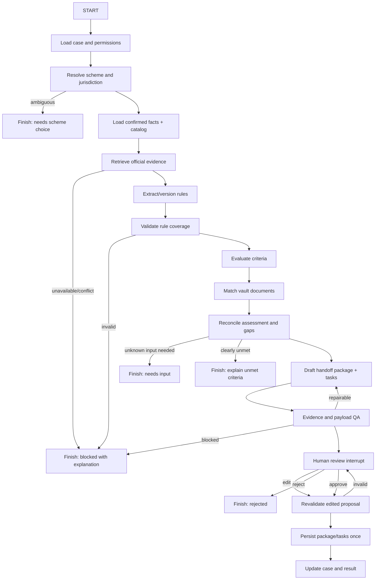
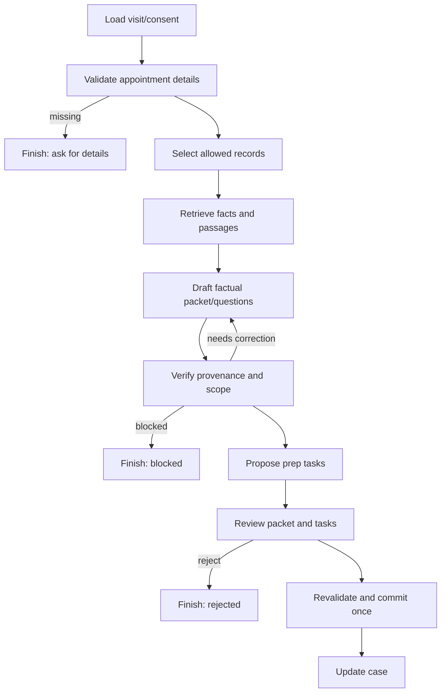
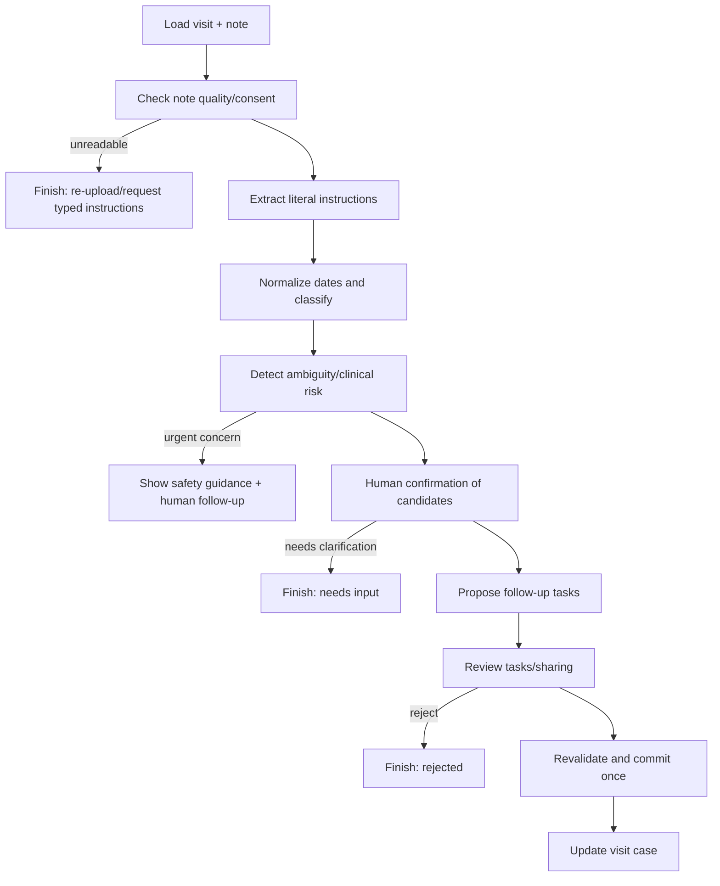

# SeniorLife OS — workflow-level technical blueprint

**Status:** Design specification for review. No implementation code.  
**Primary build targets:** (1) Document → Benefits Case Manager, (2) Healthcare Visit Coordinator.  
**Basis:** [SeniorLife OS master blueprint](SeniorLife-OS-Master-Blueprint.md). The design below deliberately narrows some earlier ideas so each graph can be implemented, tested, and demonstrated end to end.

## 0. Decisions that govern every workflow

1. **A case is the durable business object; a graph run is one attempt to advance it.** A case can live for weeks and have many runs. A run can pause for immediate review, but it should not remain interrupted for weeks while someone obtains a document or attends an appointment. Those events start a new run against the same case.
2. **Split document intake from benefit reasoning.** Uploading and confirming a document is its own reusable graph. A benefits run consumes only confirmed fields and vault metadata; it never silently treats an OCR guess as a fact.
3. **Split healthcare into pre-visit and post-visit graphs.** They have different inputs, dates, evidence, and approvals. Both attach to one visit case.
4. **Do not make “everything an agent.”** API authorization, file storage, validation, task creation, state transitions, and notifications are deterministic services. Use LLM nodes where interpretation or plan selection is genuinely needed.
5. **Source and user fact provenance are mandatory.** Each rule, extracted value, and proposed action has a pointer to the evidence that produced it. “Unknown” is a valid outcome. A scheme page found through search is not automatically authoritative.
6. **Approval is an explicit command boundary.** A graph prepares a typed proposal; the UI displays the exact fields and recipients; the user approves, edits, or rejects; only then does a side-effect node execute with an idempotency key.
7. **Keep the stack close to the existing practice:** Python, LangGraph, LangChain tools, Pydantic, OpenAI, LangSmith. Add FastAPI, PostgreSQL with pgvector, and private document storage for the integrated app. Use Streamlit as a graph development console if useful. React is the intended senior-facing frontend.

### Terms and output contracts

| Term | Meaning |
|---|---|
| `case_id` | Durable user goal, e.g. “apply for pension” or “cardiology visit on 12 Oct.” |
| `run_id` / `thread_id` | One graph execution and checkpoint cursor. Each new attempt gets a new run ID unless resuming a pending interrupt. |
| `document_id` / `document_version_id` | Logical document and immutable uploaded version. Only confirmed fields from a version can become user facts. |
| `evidence_id` | Immutable reference to a source snapshot, page/region, or user-entered fact with timestamp and origin. |
| `proposal_id` | Typed action bundle awaiting review: field corrections, case package, tasks, share, or message. |
| `approval_id` | Record of the authorized actor's approve/edit/reject decision and final payload hash. |
| `status` | A user-visible lifecycle value, never an LLM-only label. |

Every graph emits a **workflow result envelope**: `run_id`, `case_id`, `status` (`completed`, `awaiting_review`, `needs_input`, `blocked`, `failed`), `display_summary`, `evidence_ids`, `proposal_ids`, `created_record_ids`, `warnings`, and `next_allowed_actions`. It also emits progress events during execution. It does **not** emit private chain-of-thought or raw credentials.

## 1. Shared infrastructure built once

### 1.1 Identity, profile, consent, and access

**Canonical profile:** `senior_profile` stores language, locale/time zone, accessibility preferences, location at useful granularity, and confirmed facts needed for workflows. Sensitive domains are separate: health background and benefit eligibility facts have purpose tags, source, confirmation status, and validity dates. A conversation statement can create a *candidate* fact, not a confirmed one.

**Authorization model:** account roles (`senior`, `family`, `caregiver`, `admin`) are only a starting point. Actual access is governed by scoped grants: resource or case, action (`view_summary`, `view_document`, `edit_task`, etc.), recipient, purpose, expiry, and revocation. The senior owns decisions by default. A family member cannot approve on the senior's behalf unless an explicit grant permits that precise action. API requests and every tool read/write recheck authorization. Tools receive an authenticated actor context from FastAPI, never an actor identity supplied by an LLM.

**Minimum MVP:** one senior account and one optional invited family account, case/task summary sharing, no implicit access to identity or medical files. Use synthetic or consented test data.

### 1.2 Cases and runs

**Case service:** creates a case, controls allowed transitions, records timeline events, associates documents/tasks/assessments, and exposes the next action. Example case states: `created`, `gathering_information`, `evaluating`, `needs_input`, `needs_review`, `ready_for_handoff`, `awaiting_external_step`, `follow_up`, `completed`, `cancelled`, `blocked`. A domain case also has typed details (`benefit_case` or `visit_case`). A run record stores graph name/version, checkpoint thread ID, start/end times, current node, status, and error category.

**Concurrency rule:** at most one *mutating* active run per case. Read-only analysis may fan out within a run. Use a case version number for optimistic locking. If a second user action arrives during a mutation, queue it or reject with a “case changed; refresh” response.

### 1.3 Document vault and extraction

Private file storage holds original bytes; PostgreSQL stores metadata, extracted-field candidates, confirmed fields, processing status, checksums, and version relationships. A document can be replaced without overwriting the original. Retrieval indexes only permitted, reviewed text where possible. OCR/vision output carries page/region and confidence/quality indicators; the UI lets a user inspect the source crop/page while editing.

The vault exposes narrow operations: upload; fetch permitted metadata/content; list confirmed fields; search permitted chunks; compare type/expiry/owner requirements; confirm or reject extraction; revoke/share access. It never exposes a general “read every user file” tool.

### 1.4 Evidence, retrieval, and provenance

Two evidence classes are kept separate:

- **Personal evidence:** confirmed user facts or reviewed document fields with `document_version_id`, page/region, reviewer, and confirmation time.
- **External evidence:** official or curated source snapshots with publisher, URL, jurisdiction, retrieval time, effective date if stated, content hash, and relevant passage.

The retrieval service accepts a purpose, case, actor, query, and allowed source types. It applies metadata authorization before returning chunks. Exact numeric/date fields come from structured records, not vector similarity. For government criteria, search may discover a page, but a source validator must mark it official/curated before the rule extractor uses it. Snapshot the page used for a decision so a later changed website does not silently rewrite an old assessment. Reassessment uses a new snapshot/version.

### 1.5 Tasks, reminders, notifications

A `task_proposal` can come from any graph. The task service validates owner, assignee, due date/time zone, visibility, and duplicate key. After approval, tasks are persisted and a scheduler creates reminder occurrences. The scheduler, not an LLM, decides when to send. Notifications are sent only through opted-in channels and are recorded with delivery status. A case timeline receives task-completion events and can trigger a fresh graph run if the new event changes the case plan.

### 1.6 Human review and side effects

The reusable action-review boundary accepts a typed proposal with: title, plain-language explanation, exact changes, recipients, source/evidence links, risk category, and expiry. It returns `approve`, `edit`, or `reject` plus actor and timestamp. Only a currently authorized actor may respond. The graph checkpoint resumes with the same `thread_id`. A deterministic executor validates the final edited payload again, rechecks permissions and case version, writes an `approval`/`audit_event`, and performs each side effect once using `action_id`/idempotency key. If approval expires or permissions change, create a new proposal.

Use a graph interrupt for a short review interaction. A long real-world wait (collecting documents, going to a doctor, receiving an application response) ends the current run as `needs_input` or `awaiting_external_step`; a later event starts a new run. This avoids retaining an interrupted process as the business case itself. [LangGraph's checkpoint and interrupt guidance](https://docs.langchain.com/oss/python/langgraph/interrupts) informs the short review boundary.

### 1.7 Checkpoints, memory, and tool adapters

Use a durable LangGraph checkpointer for the integrated prototype and a unique `thread_id` per run. Checkpoint only compact graph state: IDs, structured decisions, evidence references, and proposed payloads. Database records remain authoritative and are re-read after resuming. Cross-run preferences/facts live in application tables (or a carefully governed long-term store), not in one thread's checkpoint. [LangGraph distinguishes thread checkpoints from cross-thread stores](https://docs.langchain.com/oss/python/langgraph/persistence).

Every external dependency sits behind a narrow adapter: `profile_reader`, `vault_reader`, `source_search`, `official_page_fetcher`, `document_extractor`, `task_writer`, `package_exporter`, `notification_sender`, and later `maps_provider`. Tool results have typed success/error states, source IDs, timestamps, timeouts, and bounded retries. The LLM cannot choose an arbitrary URL for download or issue unrestricted SQL. Prompt-injection-like instructions found in documents/pages are treated as data.

### 1.8 Database inventory and ownership

| Table / entity | Owner service | Main use |
|---|---|---|
| `accounts`, `senior_profiles`, `profile_facts` | Identity/profile | Actor identity, preferences, confirmed facts, validity |
| `consent_grants`, `trusted_contacts` | Consent | Per-resource sharing and delegated action scope |
| `cases`, `case_events`, `workflow_runs` | Case | Business lifecycle and graph-run linkage |
| `documents`, `document_versions`, `document_fields`, `document_chunks` | Vault | Files, extraction candidates, reviewed fields, retrieval |
| `source_snapshots`, `source_passages`, `scheme_catalog`, `scheme_rule_versions` | Evidence/catalog | External source provenance and curated rule versions |
| `eligibility_assessments`, `criterion_results`, `document_requirements`, `application_packages` | Benefits | Case-specific assessment and handoff artifacts |
| `appointments`, `visit_packets`, `visit_instructions` | Healthcare | Visit details and confirmed post-visit items |
| `action_proposals`, `approvals`, `audit_events` | Review/audit | Exact reviewed payload and action trail |
| `tasks`, `reminders`, `notification_deliveries` | Task/notification | Durable follow-up and delivery |
| `graph_checkpoints` (library-managed) | LangGraph | Execution resume state, not business truth |

For MVP, these can be a practical set of normalized tables, not one table per conceivable feature. The names express ownership and expected relationships; final migrations can consolidate where sensible.

## 2. Workflow 1 — Document → Benefits Case Manager

### 2.1 Purpose and user journey

**Problem:** A senior wants to apply for a benefit but cannot easily discover the current official rules, determine what is known about their eligibility, find the right documents, or remember what remains to do.

**Representative journey:** Meera, 68, asks in Hindi/English, “Can you help me apply for an old-age pension?” She confirms her state/district. The app shows two plausible schemes and asks her to choose one. It reads a current official source snapshot for the chosen scheme. It knows her age from a reviewed identity document but has no confirmed income evidence. The assessment marks age `met`, income `unknown`, and residence `unknown` if no proof exists. It asks for the needed facts/files. Meera uploads an income certificate; the document graph extracts the amount and date but flags a low-quality date. She corrects it. A new benefits run reassesses the case, proposes an application checklist and a private reminder to visit the official portal/service center, and pauses for review. After approval it exports a reviewed handoff packet. Meera later records her submission receipt; the case moves to follow-up and a reminder is scheduled. At no point does the app claim guaranteed eligibility or pretend it submitted the form.

### 2.2 Workflow boundary, inputs, and outputs

**Entry triggers:** user request to start a benefits case; explicit scheme selection; confirmed profile fact or document added to an open case; manual request to reassess; reported submission/status update. A document upload first runs the document-intake graph and emits a `document.confirmed` event; it does not directly mutate an in-progress benefits checkpoint.

**Input contract:** authenticated actor context; optional `case_id`; selected `scheme_id` or natural-language need; locale/jurisdiction; optional document IDs; trigger event ID; expected case version. The graph loads permitted profile data and current source/rule versions itself. Client-supplied “age” or “income” is an unconfirmed candidate until reviewed.

**Outputs:** criterion-level provisional assessment with evidence; unknown/conflict list; document-gap matrix; next-input request or reviewable application package; tasks only after approval; source citation set; case status and next action. The export is a checklist/field worksheet and permitted document references, not a forged completed application form.

### 2.3 Graph composition

The **Document Intake graph** and **Document Match subgraph** are separate reusable components. The benefits graph may call the match subgraph, but upload/extraction is an event-driven predecessor rather than an embedded upload node. The **Evidence Retrieval subgraph** may serve official-source gathering. A scheme-choice prompt or missing-document request ends the run; the next response starts a fresh run.

### 2.4 Benefits graph state schema (conceptual, no code)

| Field | Type / source | Meaning and invariant |
|---|---|---|
| `run_id`, `thread_id`, `case_id`, `actor_id`, `case_version` | IDs / API and case service | Identity, checkpoint, optimistic locking. Never model-generated. |
| `trigger_type`, `trigger_event_id`, `locale`, `jurisdiction` | enum/IDs / API | Why this run began and where rules apply. |
| `need_text`, `scheme_candidates`, `selected_scheme_id` | text/list/ID | User intent and chosen catalogue entry. Selection must be explicit if ambiguous. |
| `profile_fact_refs` | list of IDs | Confirmed facts only; each has source and validity. |
| `source_snapshot_ids`, `rule_version_id` | IDs | Exact external evidence used in this assessment. |
| `criteria` | structured list | Rule IDs, operators/values, document requirements, exceptions, citations, effective dates. |
| `criterion_results` | list | For each criterion: `met`, `unmet`, `unknown`, `conflict`; fact refs, source refs, rationale. |
| `document_matches` | list | Requirement ID → document version, status (`usable`, `missing`, `expired`, `unconfirmed`, `mismatch`), reason. |
| `missing_inputs`, `contradictions` | lists | Specific questions/files or incompatible facts/rules requiring resolution. |
| `package_proposal_id`, `task_proposal_ids` | IDs | Typed proposals; no external action has happened yet. |
| `approval_decision`, `approved_payload_hash` | enum/hash | Filled only after authorized review. |
| `route`, `retry_counts`, `errors`, `warnings` | control fields | Bounded retry and failure state. |

State carries references and small structured values; it does not carry whole PDFs or full source pages. The persisted `eligibility_assessment` is a versioned output of a run. Reassessing creates a new assessment rather than overwriting history.

### 2.5 Node specification

| Node | Kind | Exact responsibility | Tools/data | Emits |
|---|---|---|---|---|
| B1 `load_case_context` | Deterministic | Verify actor/case permissions, lock or read case version, load confirmed profile refs and open tasks | Case/profile/consent adapters | IDs, context, or authorization error |
| B2 `resolve_scheme` | LLM-assisted + deterministic catalogue check | Map request to curated candidates; validate jurisdiction; require explicit choice if ambiguous | Scheme catalogue, structured LLM classification | Chosen scheme or choice request |
| B3 `load_relevant_facts` | Deterministic | Load only facts needed by selected scheme, with validity and source refs | Profile reader, vault metadata | Fact refs, missing fact names |
| B4 `retrieve_scheme_evidence` | Tool-driven; optional LLM query planning | Search/fetch allowlisted official or curated sources, snapshot passages and dates | Search adapter, official fetch, evidence store | Snapshot IDs, retrieval errors |
| B5 `extract_rules` | LLM-assisted | Convert source passages to typed eligibility criteria and document requirements, preserving cited passages | Structured LLM, source reader | Candidate rule version |
| B6 `validate_rule_set` | Deterministic + targeted review | Check each criterion has source, jurisdiction/effective date, parseable requirements; compare to curated catalogue; flag conflicting source versions | Rule validator, scheme catalogue | Validated criteria or conflict |
| B7 `evaluate_criteria` | Deterministic first; LLM only for non-tabular language | Compare confirmed facts to rule predicates; never infer missing facts; produce criterion statuses and explanations | Fact reader, rule evaluator | Criterion results |
| B8 `match_documents` | Reusable deterministic subgraph | For each requirement, find accessible confirmed document version; check type, owner/name, issue/expiry, required fields | Vault metadata, requirement matcher | Match matrix and gaps |
| B9 `reconcile_assessment` | Deterministic | Combine criteria and document matrix; route to unmet, missing input, conflict, or package; store assessment version | Assessment repository | Assessment ID, route |
| B10 `draft_handoff` | LLM-assisted drafting + deterministic assembly | Draft plain-language checklist/field worksheet and proposed tasks from verified fields; label unfilled fields | Template/catalogue, structured LLM, package builder | Typed package/task proposals |
| B11 `quality_gate` | Deterministic checks + optional LLM critic | Ensure each material claim has evidence, no unknown is stated as met, no unapproved sensitive file is included, dates are current enough, payload fits schema | Citation validator, consent checker, schema validator | Pass, bounded repair, or blocked |
| B12 `review_action` | HITL | Present exact package, included documents/fields, tasks, and any recipient; await approve/edit/reject | Checkpointer, proposal service | Authorized decision |
| B13 `revalidate_review` | Deterministic | Validate edited payload, case version, grants, expiry, and idempotency IDs | Consent/case validators | Executable proposal or re-review |
| B14 `commit_handoff` | Deterministic side effect | Save package and approved tasks once; create export artifact; audit outcome | Package/task/audit adapters | Record IDs/result |
| B15 `finalize_case` | Deterministic | Set case status/next action and publish timeline event | Case service | Result envelope |

**Decision on “agents”:** B2, B5, and B10 are bounded LLM nodes. B4 may use an LLM to formulate a search query, but the source policy and fetch are deterministic. B7 should use rule code for simple numeric/date conditions; only exceptionally complex prose needs model-assisted interpretation and must be flagged for review. B11 is a gate, not an autonomous opinion-maker.

### 2.6 Reusable document-intake graph used before benefits

**Inputs:** uploaded file version ID, owner, claimed document type (optional), originating case ID (optional). **Output:** `confirmed_document_version_id` and confirmed field IDs, or `needs_reupload`/`rejected`.

| Node | Kind | Responsibility / routing |
|---|---|---|
| D1 `validate_upload` | Deterministic | Enforce file type/size, checksum, malware scan if available, owner authorization; invalid → reject. |
| D2 `classify_document` | LLM/vision + catalogue | Propose type; unknown/ambiguous → user selects. |
| D3 `extract_content` | OCR/vision tool | Extract text, page locations, candidate fields; unreadable → re-upload. Retry transient provider errors only. |
| D4 `validate_candidates` | Deterministic | Check date/value formats, obvious chronology, owner match, duplicates, expiry; contradictions → review flags. |
| D5 `human_field_review` | HITL | User sees original page alongside each candidate, edits/confirms type and fields; reject or confirm. |
| D6 `publish_confirmed_version` | Deterministic | Persist reviewed fields, update vault index with allowed text, emit `document.confirmed` case event once. |

**Fan-out:** OCR of pages can run in parallel after validation, then merge page-indexed results. Field extraction by document section can parallelize only if page provenance and merge determinism are preserved. Avoid parallel writes to the same document version.

### 2.7 Conditional routing, parallelism, and recovery

**Routing rules:**

- No valid scheme match → ask for jurisdiction or scheme choice; do not invent a programme.
- Official source unavailable or undated/conflicting on a material rule → `blocked_source_review`; save what is known, show the unresolved rule, and allow a new run after source update.
- Criterion definitely unmet → show which rule and fact led to that result, offer another scheme search or a correction path; do not build an application package for that scheme.
- Unknown fact or missing/unconfirmed document → `needs_input` with an ordered list and upload/request controls. A later confirmation event triggers a new assessment run.
- All critical criteria met and requirements available → draft package; review; commit.
- Case changed during review → invalidate or rebase proposal, then show a fresh diff to the approver.

**Parallel work:** External source fetches from a small approved set can run concurrently; rule extraction can operate per source/passage; independent document requirements can be matched concurrently. Merge must detect contradictory rule values and duplicate documents. Never parallelize case status writes or action execution.

**Retries:** transient search/OCR/network failures get a small bounded retry with backoff; invalid structured output gets at most one repair attempt; bad source credibility, conflicting eligibility rules, and missing user facts never get “solved” by repeated model calls. A failed commit checks the idempotency record before retrying. Log failure category, keep the case accessible, and expose a manual retry after the dependency recovers.

**Persistence:** Save a new `eligibility_assessment` and rule/source refs even when the outcome is unknown. Checkpoint after evidence collection, assessment, and before review. On resume, revalidate authority and case/source version before committing. Keep document upload as a separate graph/run. Preserve package versions and which exact assessment they were based on.

### 2.8 Tables, FastAPI surface, and frontend

**Tables used:** shared `accounts`, `senior_profiles`, `profile_facts`, `consent_grants`, `cases`, `case_events`, `workflow_runs`, `documents`, `document_versions`, `document_fields`, `document_chunks`, `source_snapshots`, `source_passages`, `scheme_catalog`, `scheme_rule_versions`, `eligibility_assessments`, `criterion_results`, `document_requirements`, `application_packages`, `action_proposals`, `approvals`, `tasks`, `reminders`, `audit_events`.

**API candidates:**

| Endpoint concept | Purpose |
|---|---|
| `POST /documents/uploads` | Create/upload private document version. |
| `GET /documents/{id}/review`, `POST /documents/{id}/confirm` | Show source and candidate fields; submit review decision. |
| `POST /benefit-cases` | Start case with need or selected scheme. |
| `POST /benefit-cases/{id}/runs` | Reassess after new facts/source updates or user request. |
| `GET /benefit-cases/{id}` | Case timeline, current assessment, next action. |
| `GET /benefit-cases/{id}/assessments/{assessment_id}` | Criterion/evidence and document gap detail. |
| `GET /benefit-cases/{id}/packages/{package_id}` | Approved handoff artifact. |
| `POST /benefit-cases/{id}/submission-report` | User reports a portal/service-center submission and receipt. |
| `GET /runs/{run_id}/events`, `GET /approvals/{id}`, `POST /approvals/{id}/decision` | Generic progress and review APIs shared across graphs. |

**Frontend must show:** scheme selection with jurisdiction; user fact collection and source labels; document upload/review with source preview; criterion matrix (`met/unmet/unknown/conflict`); document checklist with expired/unconfirmed distinction; citation link and retrieved date; proposed handoff packet with exactly which files/fields will be included; approve/edit/reject controls; case timeline and reminder list. A “not enough information” page is a real outcome, not an error screen.

### 2.9 Scope boundary

| Phase | Included |
|---|---|
| **MVP/demo** | One jurisdiction, 2–3 curated schemes, confirmed profile facts, PDF/image document intake, official-source snapshots, criterion matrix, document gap matching, reviewable checklist/export, manual submission tracking, in-app reminders. |
| **Final project** | More schemes within a curated pilot, stronger source refresh and conflict handling, family task sharing with scoped consent, multilingual UI/text, formal evaluation and LangSmith traces, email reminders if reliable. |
| **Future extension** | Official portal submission where an authorized API exists, broader geographic catalogue, supported e-sign/identity integrations, external status polling, service-center appointment assistance. |

**Acceptance demonstration:** A missing income document causes a `needs_input` result; after reviewed upload, a new run changes only the evidence-dependent criteria; approval creates one package and one set of tasks even if the execution node is retried. The assessment cites the exact source version and personal document fields used.

## 3. Workflow 2 — Healthcare Visit Coordinator

### 3.1 Purpose and user journey

**Problem:** Preparing for a visit and remembering the doctor's follow-up instructions require collecting scattered records, questions, dates, and family help. The system should coordinate this without pretending to provide medical judgment.

**Representative journey:** Arjun has a cardiology appointment next Thursday, entered manually by him. He chooses two prior reports and a medication list to include in a visit packet. The app drafts a factual one-page summary and questions he wants to ask; he edits and approves it. The app creates a “bring reports” task and an appointment reminder. After the visit he uploads a photographed note. The extractor identifies a follow-up visit in four weeks and a test request, but one handwritten date is ambiguous. It displays the exact source crop, asks Arjun to correct the date, then proposes two tasks. He approves the tasks. The app does not interpret the test result or adjust medicines.

### 3.2 Split graph boundaries, inputs, and outputs

**Visit case:** one durable case linked to an appointment record and optional packet/instructions. Its phases are `planning`, `packet_ready`, `visit_pending`, `post_visit_processing`, `follow_up`, `complete`.

**Pre-visit graph input:** authenticated actor, `visit_case_id`, appointment details or a reference to a confirmed appointment, selected permitted document IDs, user-provided concerns/questions, sharing scope, expected case version. **Output:** approved factual visit packet (or draft needing review), confirmed preparation tasks/reminders, next action.

**Post-visit graph input:** authenticated actor, `visit_case_id`, note document version ID or user-entered instructions, expected case version. **Output:** literal extracted instruction candidates with source pointers; confirmed follow-up items; approved tasks/reminders; ambiguities requiring clarification. An uploaded note first passes the shared document-intake/field-review path appropriate for medical notes.

The long interval between the appointment and the later note is handled by two runs and the shared visit case, not one graph suspended for days.

### 3.3 Pre-visit graph structure and state

**State fields:** `run_id`, `case_id`, `actor_id`, `case_version`; `appointment_id`, `appointment_time`, `time_zone`, `location`; `selected_document_version_ids`, `permitted_fact_refs`, `user_questions`; `retrieved_passage_refs`; `packet_draft_id`, `unsupported_claims`, `missing_context`; `task_proposal_ids`, `sharing_scope`, `approval_id`; `route`, `retry_counts`, `errors`. The graph should store references, not complete medical records.

| Node | Kind | Exact responsibility | Tools/data | Emits |
|---|---|---|---|---|
| P1 `load_visit_context` | Deterministic | Verify ownership/grants, load appointment and case state, capture version | Case/appointment/consent | Authorized context |
| P2 `validate_appointment` | Deterministic | Verify date/time zone, location if relevant, past/future state; ask for missing details | Date/appointment validator | Valid details or input request |
| P3 `select_records` | Deterministic + user choice | Use user-selected files and consent scope; suggest potentially relevant types without auto-sharing | Vault metadata, consent | Selected IDs |
| P4 `retrieve_record_facts` | Deterministic retrieval | Fetch confirmed fields and cited passages only for selected records | Vault reader, filtered retrieval | Evidence refs, quality flags |
| P5 `draft_visit_packet` | LLM-assisted | Draft factual summary, user concern list, and questions; distinguish user statements from records | Structured LLM, packet template | Draft packet |
| P6 `verify_packet` | Deterministic + bounded LLM check | Verify each factual statement maps to a source/user statement; remove unsupported claims, check privacy scope and page refs | Citation/consent validators | Pass, repair request, or block |
| P7 `propose_prep_tasks` | Deterministic/templates, LLM for wording only | Propose “bring documents,” travel timing, and appointment reminder without medical instructions | Task proposal service | Proposed tasks |
| P8 `review_packet` | HITL | Show packet, selected record list, questions, tasks, any planned recipient; accept edits/rejection | Proposal/checkpoint service | Decision |
| P9 `commit_packet` | Deterministic side effect | Validate final payload and permissions, save packet/task versions idempotently | Packet/task/audit adapters | Record IDs |
| P10 `finalize_previsit` | Deterministic | Update case/timeline and next action | Case service | Result envelope |

**Parallelism:** independent selected document retrieval can fan out, then merge by document ID/page. Do not parallelize packet drafts and consent evaluation because the draft needs the final permitted set. A user can request regeneration, but that creates a new draft version before approval.

### 3.4 Post-visit graph structure and state

**State fields:** common run/case/actor/version IDs; `note_document_version_id` or `typed_instruction_id`; `source_page_refs`, `image_quality`; `instruction_candidates` with literal text and provenance; `normalized_dates` with time zone and uncertainty; `ambiguity_flags`, `urgent_language_flags`; `confirmed_instruction_ids`; `task_proposal_ids`, `approval_id`; `route`, `retry_counts`, `errors`.

| Node | Kind | Exact responsibility | Tools/data | Emits |
|---|---|---|---|---|
| Q1 `load_postvisit_context` | Deterministic | Verify case, user, note access and version; prevent wrong-visit attachment | Case/vault/consent | Authorized context |
| Q2 `assess_note_quality` | OCR/vision + deterministic threshold | Detect unreadable/partial note and page count; route to re-upload or typed entry | Document extractor, quality checks | Source text/regions or quality error |
| Q3 `extract_literal_instructions` | LLM/vision-assisted | Extract *what the note says* into typed candidates: appointment, test, referral, general instruction; quote/source region | Structured LLM, OCR result | Candidate list with provenance |
| Q4 `normalize_schedule` | Deterministic | Resolve explicit dates relative to visit time and locale; preserve ambiguous phrases as unknown | Date parser, time-zone rules | Proposed due dates or ambiguity |
| Q5 `safety_and_ambiguity_gate` | Deterministic rules + conservative LLM flagging | Detect unsupported clinical inference, unclear handwriting/dose, or urgent language. Do not translate these into medication changes | Safety rules, source checker | Flags and route |
| Q6 `confirm_instructions` | HITL/input review | Show source crop/text and candidate type/date; user edits/confirms. For clinically consequential ambiguity, require confirmation from clinician or leave unresolved | Proposal/checkpoint service | Confirmed literal instructions or unresolved items |
| Q7 `propose_followup_tasks` | Deterministic/templates | Turn confirmed non-medication follow-ups into tasks with due dates and owners | Task proposal service | Task proposals |
| Q8 `review_followup_tasks` | HITL | Show exact tasks, reminders, assignees, sharing scope; approve/edit/reject | Proposal/checkpoint service | Decision |
| Q9 `commit_followup` | Deterministic side effect | Recheck access/case version, save confirmed instruction and tasks once, audit | Visit/task/audit adapters | Record IDs |
| Q10 `finalize_postvisit` | Deterministic | Update timeline and completion conditions | Case service | Result envelope |

**Clinical boundary:** The graph may create a task such as “Call clinic about the test requested on page 1” or “Follow-up visit around [confirmed date].” It should not create a medication-dose reminder from unverified OCR, infer diagnosis, recommend treatment, or decide urgency based solely on a model. If text appears urgent, display direct advice to contact appropriate human care; do not run an autonomous emergency action.

### 3.5 Branching, retries, contradictions, and persistence

**Pre-visit branches:** missing date/time → user input; no selected records → allow a packet based solely on user-entered concerns, explicitly marked; revoked permission → drop document and re-review; past appointment → offer post-visit path; unsupported statement → repair once or show editable draft with warning.

**Post-visit branches:** unreadable photo → re-upload/typed entry; two conflicting dates → show both source locations and ask for confirmation; a note from another date/person → block attachment pending user review; ambiguous handwriting or medication instructions → preserve literal text and request clinician confirmation; no actionable follow-up → save note and close run without manufacturing tasks.

**Retries:** transient OCR/provider errors get bounded retry; schema failure gets one structured repair; unclear medical text is never resolved through repeated guesses. If task save fails after partial work, use action IDs to detect already-created items before retry. A case version change during approval forces proposal refresh.

**Persistence:** Save appointment and packet versions, selected source document IDs, approved sharing scope, literal instruction candidates and confirmed values, task proposals/approvals, and case events. Pre- and post-visit have distinct `workflow_runs` and checkpoints. Checkpoint before each review and after extraction. The original note file remains private; redacted traces record IDs and error categories, not full medical content.

### 3.6 Tables, FastAPI surface, and frontend

**Tables used:** shared identity/consent/case/run/vault/evidence/proposal/approval/task/reminder/audit entities plus `appointments`, `visit_packets`, and `visit_instructions`.

| Endpoint concept | Purpose |
|---|---|
| `POST /visit-cases` | Create a visit case with manually entered appointment details. |
| `PATCH /visit-cases/{id}/appointment` | Edit appointment details with version check. |
| `POST /visit-cases/{id}/previsit-runs` | Generate/re-generate packet and preparation proposal. |
| `GET /visit-cases/{id}/packet/{packet_id}` | Retrieve approved packet and citations. |
| `POST /visit-cases/{id}/notes` | Attach a post-visit note through document intake. |
| `POST /visit-cases/{id}/postvisit-runs` | Extract proposed follow-ups from confirmed note/typed input. |
| `GET /visit-cases/{id}/instructions` | Show literal/confirmed/unresolved instructions and source refs. |
| Generic run/approval/task endpoints | Stream progress, review payload, decide, and update task status. |

**Frontend must show:** appointment card with local time zone; explicit document selector and sharing summary; evidence-backed packet editor; questions checklist; review panel for task proposals; note image/PDF with highlighted source text; extracted instructions divided into “confirmed,” “needs clarification,” and “no task created”; exact reminder dates; case timeline. Accessibility includes keyboard use, large controls, clear labels, and a text path equivalent to any voice path.

### 3.7 Scope boundary

| Phase | Included |
|---|---|
| **MVP/demo** | Manual appointment entry, selected-record factual packet, user-reviewed questions/prep tasks, typed or clearly printed post-visit instructions, manual confirmation of follow-up dates, in-app reminders. |
| **Final project** | Scan/photo OCR with ambiguity review, stronger provenance display, scoped family task assistance, multilingual text/voice interface if reliable, usability evaluation, optional email reminders. |
| **Future extension** | Provider discovery, live availability/booking through supported APIs, accessible travel assistance, calendar sync, clinician portal integration, medication support only with a separately designed clinical safety process. |

**Acceptance demonstration:** Selecting one report includes only that report's confirmed facts in the packet; revoking its grant before approval removes it. A poor-quality note asks for correction. One ambiguous date produces no scheduled task until confirmed. Replaying the approved commit creates no duplicate reminders.

## 4. Later workflows at lower design depth

### 4.1 Scam/suspicious-message check

**Purpose:** Help a senior assess a suspicious SMS, website claim, or screenshot and choose a safer next step. **Journey:** User uploads a fake “account blocked” message; the graph extracts text/URL, checks for OTP requests and impersonation, optionally verifies the claimed organization against an official source, explains the warning signs, and asks before sending an alert to a trusted contact.

**Graph:** `validate_input` (deterministic) → `extract_text` (OCR/vision) → parallel `rule_signals` (deterministic) and `claim_verification` (tool/LLM-assisted) → `reconcile_risk` (bounded LLM, conservative labels) → `safety_gate` (deterministic) → optional `review_share` (HITL) → `notify_contact` (deterministic). State: input artifact ID, extracted text/URL refs, signal list, verification sources, uncertainty, proposed guidance/share, approval. Unreadable input returns “cannot assess”; an unverified message is never labeled safe. Tables: `cases`, `documents`, `source_snapshots`, `risk_assessments` (new), `action_proposals`, `approvals`, `notifications`.

**MVP/demo:** Pasted text and a small labeled set; no external reputation feed. **Final project:** Screenshot OCR, explainable flags, official-source verification, optional approved family alert. **Future:** Domain reputation feeds, email/phone integrations with strict consent. API: `POST /scam-checks`, `GET /scam-checks/{id}`, generic approval. UI: original message, extracted text, concrete red flags, uncertainty, protective actions, share approval.

### 4.2 Mobility/travel coordination

**Purpose:** Plan an accessible journey or service visit without assuming provider accessibility data is complete. **Journey:** Senior needs a clinic trip with minimal walking; system records mobility preferences, compares available routes/providers, flags unverified accessibility, produces a checklist and asks before booking or sharing.

**Graph:** `capture_constraints` (LLM-assisted form filling) → `fetch_options` (maps/provider adapters; parallel) → `validate_freshness/accessibility` (deterministic) → `rank_options` (criteria-based with model explanation) → `draft_plan` → `review_action` → `save_plan/tasks` or supported booking. State: destination/date, mobility constraints, option/source refs, verified/unknown accessibility claims, selected plan, approval. Tables: `cases`, `mobility_preferences`, `route_options`, `plans`, `tasks`, `approvals`. Failure: missing accessibility data becomes unknown; stale route/time forces refresh before approval.

**MVP/demo:** Out of first prototype. **Final project:** Optional static/mock provider data and plan/checklist if core graphs are complete. **Future:** Live maps, assisted booking, rail/air accessibility support. API: `POST /mobility-cases`, `POST /mobility-cases/{id}/plans`, `GET /mobility-cases/{id}`. UI: comparable options, source freshness, accessibility unknowns, exact action confirmation.

### 4.3 Family coordination and “what is pending?”

This is mainly **application service + read-only assistant**, not a new autonomous graph. A simple graph can interpret a broad request, query authorized cases/tasks, and produce a prioritized summary with citations to record IDs. It cannot broaden access. Family assignment and document sharing always use the common consent/approval flow. **MVP:** senior's own task list; **final:** scoped family task views; **future:** caregiver team coordination.

### 4.4 Voice and multilingual interface

Voice is a UI adapter: speech-to-text → show/edit transcript → same intake/API/graph → approved response text → optional text-to-speech. Language translation must preserve dates, amounts, names, and source references; uncertain transcript text requires confirmation before a consequential action. **MVP:** text UI. **Final:** one additional language and simple voice input/output if evaluation supports it. **Future:** broader language coverage and offline options.

## 5. Shared intake/router contract

The master blueprint proposed an intake router. Implement it as a **small optional graph** only once multiple domain workflows are available. Until then, module-specific UI entry points can create cases directly. Router nodes: `normalize_request` (deterministic), `classify_intent` (LLM with typed enum), `resolve_existing_case` (deterministic search plus user disambiguation), `authorize_context` (deterministic), `dispatch` (deterministic), `summarize_next_step` (LLM wording over authoritative result). Inputs: actor, message/transcript, attachments, case hint. Outputs: chosen workflow/case, ambiguity question, or out-of-scope guidance. It must never route a user straight into an external action.

## 6. Cross-workflow event and consistency rules

| Event | Producer | Consumer / effect |
|---|---|---|
| `document.confirmed` | Document intake | Open benefits or visit case may offer reassessment; never mutates a running graph mid-node. |
| `profile_fact.confirmed` | Profile review | Benefit case may be marked “reassessment available.” |
| `approval.decided` | Review service | Resumes exactly the pending graph run if still valid. |
| `task.completed` | Task service | Adds case event; may trigger new summary run or mark a case milestone done. |
| `source.updated` | Curated source service | Marks affected benefit assessments stale; asks for reassessment rather than silently changing history. |
| `consent.revoked` | Consent service | Blocks future reads and pending actions; approval proposals depending on the grant expire. |
| `appointment.changed` | Visit service | Invalidates prior packet/reminder proposals and requires re-review. |

Events carry stable IDs and are processed idempotently. A case's timeline is append-only for audit. Data shown to family is projected through current grants rather than copied into a second uncontrolled store.

## 7. Common failure policy and quality gates

**Recoverable dependency errors:** bounded retry on network/OCR/model timeouts with an error status in the run. No infinite loops. **Validation errors:** show the problematic field and request correction. **Evidence contradictions:** preserve both claims with sources, mark `conflict`, and stop any action that depends on the disputed fact. **Model uncertainty:** prefer an explicit question or “unknown” state. **Authorization changes:** recheck at resume/commit and discard stale proposals. **Partial side effects:** use one action ID per package/task/notification and inspect prior execution result before retry.

Every LLM output passes schema validation; every stored factual claim must reference a user-confirmed fact or external evidence; every external action requires a typed approved proposal. A tool response is data, not a prompt. Trace only redacted IDs and summaries when personal documents are involved.

## 8. Build order and “ready to implement” checklist

1. Establish identity, consent, case/version, run, proposal/approval, audit, vault, task, evidence, and checkpoint contracts.
2. Implement the document-intake graph and document review UI. Test a good scan, unreadable scan, duplicate/versioned document, and corrected field.
3. Implement benefits scheme catalogue/source snapshots and the benefits graph. Demo `unknown → reviewed document → reassessed → approved handoff`.
4. Implement visit pre- and post-visit graphs using the same vault, approval, task, and case services.
5. Add scam check and family views only after the two primary flows are complete. Add mobility and voice after core reliability and evaluation.

Before coding **any** graph, fix these configuration choices in its implementation ticket: pilot jurisdiction and schemes (for benefits); allowed document classes and sample formats; LLM/OCR provider; source refresh policy; exact approval actor rules; reminder channels; and synthetic evaluation fixtures. These are deploy-time/project choices, not reasons to leave the graph structure vague.

**Definition of done for a graph:** typed input/output and state; deterministic routing tests; evidence/provenance tests; authorization tests; interruption/resume test; retry/idempotency test; one success and one failure user journey; API event contract; trace redaction; and a frontend review path. The agentic contribution should be visible in the trace as conditional tool use and case advancement, not just a generated paragraph.

## 9. Implementation tickets this spec supports

- **“Implement Document Intake”** means D1–D6, vault review records, `document.confirmed`, and upload/review APIs.
- **“Implement Document → Benefits Case Manager”** means B1–B15 plus shared document matching, source snapshots, assessment records, action review, and the benefit-case APIs. If document intake is not yet present, it is the first dependency.
- **“Implement Healthcare Visit Coordinator”** means P1–P10 and Q1–Q10 plus appointment/packet/instruction records and visit APIs, reusing the shared vault and approval/task services.
- **“Implement Scam Check”** means the lower-level graph in §4.1, with risk explanations rather than a binary safety verdict.

This is a design contract. Node names, table names, and endpoint paths may be refined during implementation, but changes should preserve their responsibilities, authorization boundaries, evidence links, review points, and observable outcome states.
